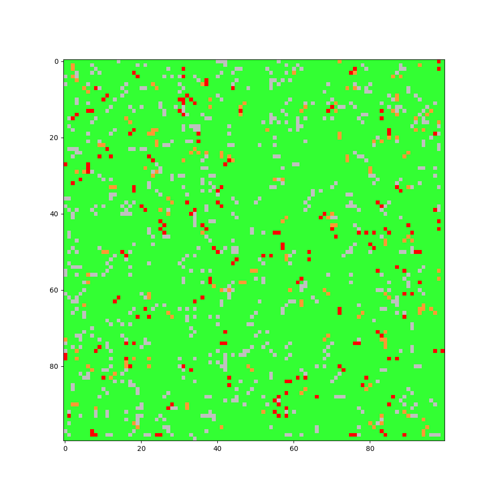

# Predator-Prey_Simulator

This repo contains simulation engines for predator-prey systems.  The customer could be conservation agencies, researchers, or people generally interested in population dynamics.  The goal is to provide a simulator to allow the customer to determine optimal grass seed to plant a field with.  Different grass seeds will suport different population dynamics, so a simulator is needed for prediction.

There are two separate simulators found in this repo, based on different conceptual models.  Each of these simulators contains its own directory:
* event_driven : An event-driven simulator. Very efficient for large systems, but makes overarching assumptions about locality.
* cellular-automaton : A cellular automata simulator.  A more realistic simulator which includes locality, movement, more detailed interactions, additional animals, and a modular template which will easily allow for adding additional species to the simulator.

